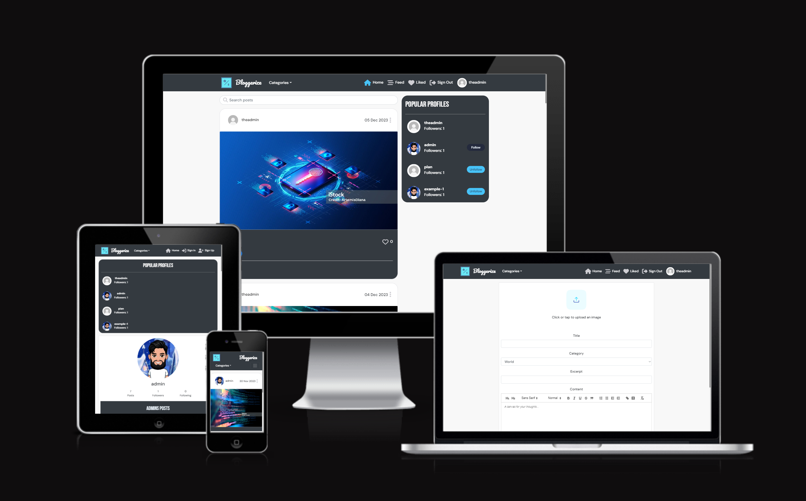
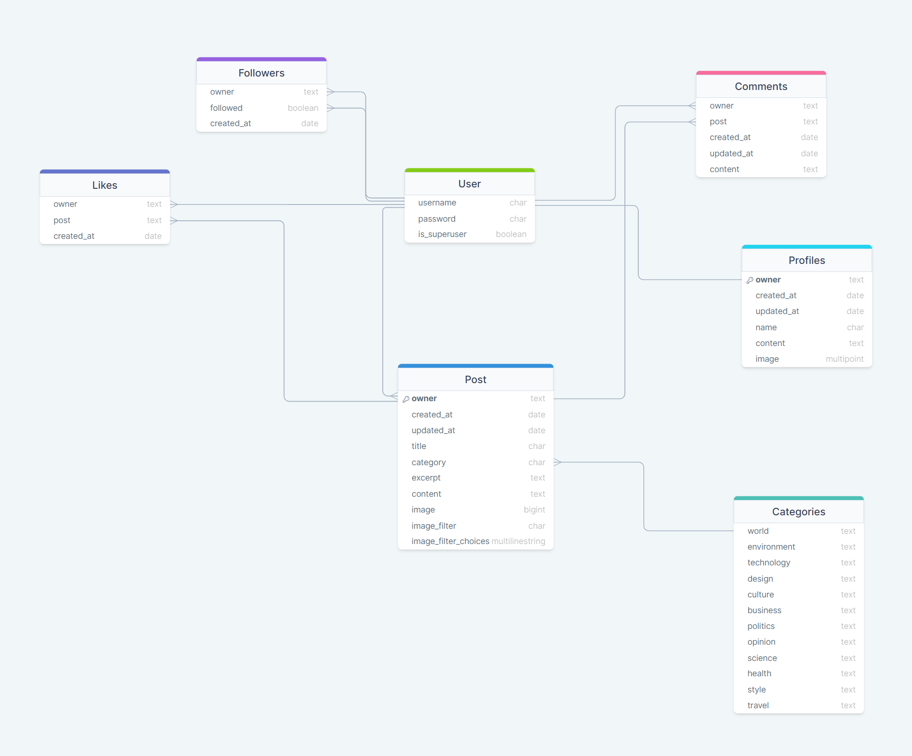

# Bloggerize

Bloggerize is my very own blog application where users can post blogs using the built-in text editor as well as post images and links to videos which can be viewed on the post page component. These blogs can be sorted into different categories to make it easier for users to filter through each blog post as well as find the specific types of blogs they are interested in. This project was built using the Django REST Framework API in the backend and React Js for the front end for a modern, responsive UI.

The primary objective of this project is to allow users to post about anything they desire or have an interest in. This could range from a post about a country they may have visited recently, a review of the latest iPhone device, a fitness tutorial video that they think is very helpful in losing weight, or simply a post about their day-to-day life. 

Additionally, users can follow other users who are authenticated on the site so that they can view all of their posts once they click on the 'Feed' link on the Navbar. This allows users to keep up to date with each post made by a user they take a liking to. They can also like a post made on the site by clicking on the heart icon displayed on each post 'card' on the right-hand side of the title. These liked posts can then be viewed once they click on the Liked nav link on the nav bar.  

Users can view all of the different categories available by clicking on the Categories dropdown menu which brings up a list of all the different categories that a blog post could fall under. If there are posts under a specific category, they will then be displayed to the user. If there are no posts under a category, they will be shown an appropriate message.

Users can open user profiles after clicking on a user's name or avatar. This page displays the number of posts they made, the number of followers they have, and the number of users they are following themselves. It also provides information about themselves as a sort of introduction as well as their username and avatar. Every post that this user has made on the site is displayed below for the audience to look at and possibly open if they are interested. 

The following documentation is the readme for the backend API section of my project. If you wish to access the readme for my React frontend, please click [here](https://github.com/Shaf8808/project-portfolio-5/blob/main/frontend.md)



<small><i><a href='https://ui.dev/amiresponsive'>Image taken from Am I Responsive?</a></i></small>

Live link:

https://django-rest-api-de0173352397.herokuapp.com/


## Table of Contents

- [Bloggerize](#bloggerize)
  * [Planning](#planning)
  * [Data models](#data-models)
    + [Post](#post)
    + [Categories](#categories)
    + [Comments](#comments)
    + [Followers](#followers)
    + [Likes](#likes)
    + [Profiles](#profiles)
  * [API Endpoints](#api-endpoints)
  * [Frameworks, libraries and dependencies](#frameworks--libraries-and-dependencies)
  * [Testing](#testing)
    + [Manual Testing](#manual-testing)
    + [Automated Testing](#automated-testing)
  * [Python validation](#python-validation)
  * [Resolved bugs](#resolved-bugs)
  * [Unresolved bugs](#unresolved-bugs)
  * [Deployment](#deployment)
  * [Credits](#credits)

Table of contents created using [TOC generator](https://ecotrust-canada.github.io/markdown-toc/)

## Planning

I began my planning process by creating user stories that would dictate the functionality of my site as well as the look and feel of my project. I would ask myself what it is that I would want my site to do to meet my needs as a user, and then work towards meeting that need.

These user stories were then mapped to API endpoints that were required to achieve the desired functionality of the site.

## Data models

My data model schema was planned using [DrawSQL](https://drawsql.app/). The reason why I decided to go with this tool is to help me visualise and map out each data table and the relationships that each table will have with one another. It is also easy to create tables using this site and quickly create links to some of the other tables included in my application.

My tables can be seen below, along with all of the different relationships they had with one another.




The custom data models that I created that made the most sense for my specific application can be found below:

### Post

As my application is a blog site, the post-data model had to be very different from a regular post-data model that was taught by the tutorial via Code Institute. Users were not just going to post simple images that could be liked and commented on by other users. They were going to post full-length blogs that included images as well as, should they wish to, embedded video URL links that would play within the content section of their blog. As such, the post-data model had to be a custom model which included fields such as excerpt and category. The data model that I created can be seen in the diagram below: 

[Back to Top](#table-of-contents)


### Categories

As I wanted to sort each blog that a user would post into a specific category, I needed to include a separate Categories data model that would contain all the different categories I chose for my application. This model would need to have a relationship with the Post data model as each post created by a user would fall under a specific category. I decided to make my custom Categories data model Textchoices as that was the simplest way to present all of the different categories in an organised manner before connecting it to the category field in the Post model. This list of choices would then be accessed via the choices property in the category CharField. The Categories model can be seen below:

On top of the two custom models that I created for my app, I have also included other models based on the Moments application tutorial that I learned from. I decided to include the models below because I believed they were all relevant to the application I was building and would enhance the overall quality of the site as well as meet certain goals set out in my user stories beforehand, such as fully integrated CRUD functionality.

### Comments

I have decided to use the comments data model very similar to the one used in the Moments app which has a direct link to my Post data model. It was important for users to be able to post, edit and delete comments of their own to engage with each blog post as well as cover CRUD functionality for my site. The data model includes a created_at and updated_at DateTimeField to display when the user posted each comment as well as edit them if they happened to do so. 

### Followers

I have included a followers data model which is related to 'owner' and 'followed'. 'followed' is a User that is followed by 'owner'. The related_name attribute is used so that Django can differentiate between 'owner' and 'followed' both are User model instances. 'Unique_together' makes sure a user can't follow the same user twice.

### Likes

I have of course added a Likes data model so that users can like posts that they wish. This is also related to my Post model through a ForeignKey. I have used the 'unique_together' attribute so that a user cannot lie the same post twice. 

### Profiles

Finally, I have included a profile data model which is used for all of the user profile information that every authenticated user will contain. These include fields such as the name, content for their bio, image for their avatar picture as well as the created_at and updated_at fields to store the time of when the profile was created and/or updated.

[Back to Top](#table-of-contents)

## API Endpoints

| **URL** | **Function** | **HTTP Method** | **CRUD operation** | **View type** |
|---|---|---:|---|---:|
|  |  |  |  |  |  
| **Comments endpoints** |  |  |  |  |  
| api/comments/ | Retrieves every comment posted by a user once the post has been selected  | GET | Read | List |
| api/comments/id/ | Edits and/or deletes a specific comment posted by a user based on its ID and if it's the owner of the comment or the admin  | PUT | Update/Delete | Detail |
| **Followers endpoints** |  |  |  |  |  
| api/followers/ | List all followers - all instances of a user following another user  | GET | Read | List |
| api/followers/id/ |  Retrieves and/or deletes a specific follower instance by a user based on its ID and if it's the owner of the profile  | GET/DELETE | Read/Delete | Detail |
| **Likes endpoints** |  |  |  |  |
| api/likes/ | Lists all posts that have been liked by a user  | GET | Read | List |
| api/likes/id/ |  Deletes a specific like made on a post by a user based on its ID and if it's the owner of the profile  | DELETE | Delete | Detail |  
| **Posts endpoints** |  |  |  |  |
| api/posts/ | Lists all posts that have been liked by a user  | GET | Read | List |
| api/posts/id/ |  Retrieves, updates and deletes a post based on its id and if you are the owner/admin  | PUT | Update/Delete | Detail |  
| **Profiles endpoints** |  |  |  |  |
| api/profiles/ | Lists all profiles that have been created on the site  | GET | Read | List |
| api/profiles/id/ |  Retrieves, updates and deletes a profile based on its id and if you are the owner  | PUT | Update/Delete | Detail |  
| **Categories endpoints** |  |  |  |  |
| api/category/ | Lists all posts with their category as well as creates a post  | GET/POST | Create/Read | List |

[Back to Top](#table-of-contents)

## Frameworks, libraries and dependencies

This project was made using Django and Django Rest Framework

Listed below are other dependencies that were used as well:

django-cloudinary-storage
https://pypi.org/project/django-cloudinary-storage/

Enables Cloudinary integration for storing user profile images in Cloudinary.

dj-allauth
https://django-allauth.readthedocs.io/en/latest/

Used for user authentication.

dj-rest-auth
https://dj-rest-auth.readthedocs.io/en/latest/introduction.html

Provides REST API endpoints for login and logout.

djangorestframework-simplejwt
https://django-rest-framework-simplejwt.readthedocs.io/en/latest/

Provides JSON web token authentication.

dj-database-url
https://pypi.org/project/dj-database-url/

Creates an environment variable to configure the connection to the database.

psychopg2
https://pypi.org/project/psycopg2/

Database adapter to enable interaction between Python and the PostgreSQL database.


django-filter
https://django-filter.readthedocs.io/en/stable/

django-filter is used to implement ISO DateTime filtering functionality for the events GET endpoint. The client can request dates within a range using the from_date and to_date URL parameters. The API performs an additional check after filtering to 'catch' any repeat events within the requested range, where the original event stored in the database occurred beforehand.

django-cors-headers
https://pypi.org/project/django-cors-headers/

This Django app adds Cross-Origin-Resource Sharing (CORS) headers to responses, to enable the API to respond to requests from origins other than its host.

For converting mp4 files to gif files
https://cloudconvert.com/


[Back to Top](#table-of-contents)

## Testing

### Manual Testing

It was important to carry out a series of manual tests for the different endpoints used throughout my project to ensure that they all worked as intended. These manual tests were carried out using the Django Rest Framework HTML interface running on the local server and the deployed database. I have documented these tests in a separate [TESTING.md](https://github.com/Shaf8808/project-portfolio-5/blob/main/TESTING.md) file.

### Automated Testing

On top of the manual tests carried out for the API of my site, I also implemented some automated tests for my post list and post detail views which can be found in my `tests.py` file in my posts directory. These tests involved checking if the post list view listed posts as intended, allowing logged-in users to create their posts, as well as if a logged-out user could create a post. These tests have been appropriately named such as `def test_logged_in_user_can_create_post(self)`.

The tests have been carried out by first creating a mock user and testing the various elements such as creating a post, seeing a list of posts etc. This is mainly done by looking at the response status code which should be a 200 ok code. 

I was heavily inspired by the Moments app tutorial when it came to creating these automated tests. I would have loved to carry out some more for the other apps included in my project, but I unfortunately ran out of available time. This is something I intend to look into in more detail, and hopefully increase my skill and confidence in.

## Python validation

All of my Python files were passed through the [CI Python linter](https://pep8ci.herokuapp.com/) and all passed the validation successfully with no errors.


## Resolved bugs

While developing this big project, I came across some bugs that needed to be resolved for the backend API of the site. The issues that I came across are listed below:

- I encountered a bug with my post submission page where once a category was selected, I was shown a 400 error code and a message stating that my chosen category was not a valid choice depending on which category I selected for my post. At first, I tried to make adjustments to my post-create form page in the front end as well as the handleChange function that I created within the file, but that didn't work. With a little help from a CI tutor, I managed to identify the issue which was the category being submitted to my API had a lowercase first letter. I therefore needed to match the value that was going to be saved in the database, which I wasn't doing at first. For example, instead of having an option element in my post create/edit a form page that looks like this:

```
<option>Politics</option>
```

I needed to add a value with a lowercase category like this:

```
<option value="politics">Politics</option>
```

To match the value in the API.

- I had a few problems when it came to migrating my data models as I was always either adding or editing my existing ones as I was developing the site further. There had been several instances where I needed to completely erase all existing data within my database (both local and external) to successfully migrate my models. This involved deleting all my files within the migrations folder (except my __init__.py file) as well as my db.sqlite3 file. I also had to reset my elephantSQL external database before migrating all of my models again. This seemed to do the trick as everything worked fine after that. 

- I was having some issues with my POST requests in my application. When I tried to post/edit/delete a post, I was subsequently shown a red 403 error in the terminal. This also occurred when I tried to log out of my current account in my application. I then found out that it was a CSRF token issue within the DEV environment of my site. I was then told by a tutor that I could comment out that variable within my env.py file and solely work within the production environment which uses the JWTCookieAuthentication.

- There was an instance while migrating my data models where I was shown the error message "InconsistentMigrationHistory: Migration comments.0001_initial is applied before its dependency post.0001_initial on database 'default'". This meant that the comments module which depends on the post module was trying to apply migrations first. This is what caused the error. I received some help from my tutor and then realised that I forgot to delete my pycache file from my migrations folder when 'nuking' my database.  

## Unresolved bugs

There are currently no unresolved bugs

## Deployment

The Bloggerize API is deployed to Heroku by utilising a Postgres database through ElephantSQL. The following steps can be taken to deploy this API.

- Fork or clone this repository in GitHub.
- Create a Cloudinary account to host user profile images.
- Login to Cloudinary.
- Select the 'dashboard' option.
- Copy the value of the 'API Environment variable' from the part starting `cloudinary://` to the end. You may need to select the eye icon to view the full environment variable. Paste this value somewhere for safekeeping as you will need it shortly.
- Log in to Heroku.
- Select 'Create new app' from the 'New' menu at the top right.
- Enter a name for the app and select the appropriate region.
- Select 'Create app'.
- Select 'Settings' from the menu at the top.
- Login to ElephantSQL.
- Click 'Create new instance' on the dashboard.
- Name the 'plan' and select the 'Tiny Turtle (free)' plan.
- Select 'select region'.
- Choose the nearest data centre to your location.
- Click 'Review'.
- Go to the ElephantSQL dashboard and click on the 'database instance name' for this project.
- Copy the ElephantSQL database URL to your clipboard (this starts with `postgres://`).
- Return to the Heroku dashboard.
- Select the 'settings' tab.
- Locate the 'reveal config vars' link and select.
- Enter the following config var names and values:
    - `CLOUDINARY_URL`: *your cloudinary URL as obtained above*
    - `DATABASE_URL`: *your ElephantSQL Postgres database URL as obtained above*
    - `SECRET_KEY`: *your secret key*
    - `ALLOWED_HOST`: *the URL of your Heroku app (but without the `https://` prefix)*
- Select the 'Deploy' tab at the top.
- Select 'GitHub' from the deployment options and confirm you wish to deploy using GitHub.
- Find the 'Connect to GitHub' section and use the search box to locate your project repo.
- Select 'Connect'
- Optionally choose the main branch under 'Automatic Deploys' and select 'Enable Automatic Deploys' if you wish your deployed API to be automatically redeployed every time you push changes to GitHub.
- Find the 'Manual Deploy' section, choose 'main' as the branch to deploy and select 'Deploy Branch'.
- Your API will shortly be deployed and you will be given a link to the deployed site when the process is complete.

## Credits

Categories data model example - https://github.com/linkedweb/blog_lyfe/tree/main

Blog example - https://blog.logrocket.com/use-django-rest-framework-to-build-a-blog/

Readme example - https://github.com/andy-guttridge/tribehub_drf/blob/main/README.md

For spell checking document - https://www.grammarly.com/

Code Institute Moments app tutorial

Code Institute tutoring

Jubril Akolade- Mentor

[Back to Top](#table-of-contents)


