# Bloggerize

Bloggerize is my very own blog application where users can post blogs using the built-in text editor as well as post images and links to videos which can be viewed on the post page. These blogs can be sorted into different categories in order to make it easier for users to filter through each blog posted as well as find the specific types of blogs they are interested in. This project was built using the Django REST Framework API in the backend and React Js for the frontend for a modern, responsive UI.

The main primary objective of this project is to allow users to post about anything they desire or have an interest in. This could range from a post about a country they may have visited recently, a review of the latest Iphone device, a fitness tutorial video that they think is very helpful in losing weight, or simply a post about their day to day life. 

Additionally, users have the ability to follow other users who are authenticated on the site so that they can view all of their posts once they click on the 'Feed' link on the Navbar. This allows users to keep up to date with each post made by a user they take a liking to. They can also like a post made on the site by clicking on the heart icon displayed on each and every post 'card' on the right hand side of the title. These liked posts can then be viewed once they click on the Liked nav link on the nav bar.  

Users can view all of the different categories available by clicking on the Categories dropdown menu which brings up a list of all the different categories that a blogpost could fall under. If there are posts under a specific category, they will then be displayed to the user. If there are no posts under a category, they will be shown an appropriate message.

Users can open user profiles after clicking on a users' name or avatar. This page displays the number of posts they made, the number of followers they have, and the number of users they are following themselves. It also provides information about themselves as a sort of introduction as well as their username and avatar. Below this, every post that this user has made on the site is displayed below for the audience to look at and possibly open if they are interested. 

The following documentation is the readme for the React frontend section of my project. If you wish to access the readme for my backend, please click [here]()

Live link:

https://django-rest-api-de0173352397.herokuapp.com/

## User Stories

The user stories that I created can be seen [here]() on the Github projects kanban board. These user stories governed the main goals and objectives of my website, as well as the design decisions made regarding it. It gave me a clear picture of what I wanted my application to achieve, and how I wanted to achieve it.

They also helped me get a better understanding of the needs of the user that would use my site, so that I could develop my site in a way that could meet those needs. In the case of software development, the user is king after all.

## User experience

As my site is primarily a social media site where users can post blogs ranging from different categories. It was important to design my app in such a way that the user could do this as easily as possible. I needed to make sure that the user experience was as positive as possible when creating the front end of my site, as that is a primary goal of UI design. I believe that my app has managed to achieve this in the clear and concise way that it has been structured and presented to my target audience.

## Design

I am very pleased with the overall look and feel of my site. It looks both professional and has a level of consistency displayed throughout the application that can be seen in my various design choices such as my colour scheme, font styles as well as the overall structure of the site. I will go into more detail regarding these different elements below.

### Colour scheme

It was important that the colour scheme I decided to go with had a balanced contrast between the background colours as well as the text colours. If there were certain sections that had a darker colour utilised, the text had to be white in order for it to be readable by the user and vice versa. The colour of my logo also needed to be consistent with some of the colours used throughout my site in order to look more presentable and consistent to the user. I believe that the colour scheme I used shown below manages to achieve that objective.

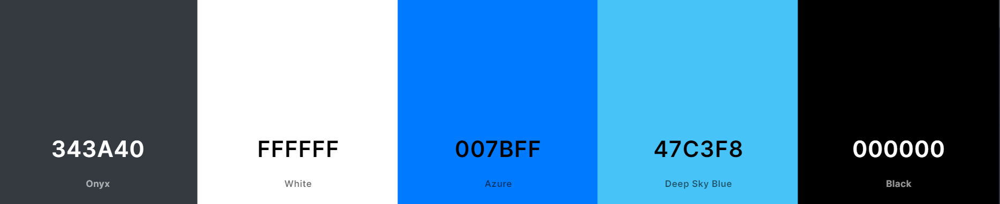

Colour scheme generated from [Coolors](https://coolors.co/)

The dark grey colour shown above was used as the colour of my navbar, my popular profiles section as well as the card subsection below the image. The white colour is used for the text whenever the dark grey background was used so that users could read the text. The blue colour was used for the badges that showed thew user which category each post belonged to. The bright blue colour was used for my nav links when a user would hover over them or for an active link. Finally, the black was used as a generic text colour on a white background. 

I have stuch to this colour scheme consistently throughout my application, as I believe that it is very important to do so and is something all professional sites practice.

### Font choice

My primary choice of font is 'DM Sans', 'Bebas Neue' and 'Pacifico, cursive'. These fonts were taken from [Google Fonts]() due to it's large library of font choices available. I also went for these fonts as they looked the most appropriate for the type of app I was building, which was important to keep ion mind. 'DM Sans' was used as a default font choice for regular text such as the different links on my navbar, the profile username shown on the top of a post card and the excerpt of a post. 'Bebas Neue' was used for the title of my post as well as the Profile name on the profile page to give it more of a custom look and feel to the site. 'Pacifico, cursive' was exclusively used for the logo of my app Bloggerize in order to give my site a personality and character. This can be seen below:


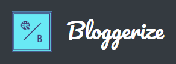

The image below is a screenshot of the 'Postbar' which is displayed on every post card. This shows the title, the category badge and the excerpt text. As you can see, the title uses the 'Bebas Neue' font while the other text uses the default 'DM Sans' font

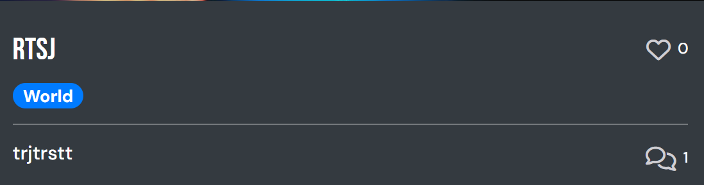

Several [Font Awesome](https://fontawesome.com/) icons were also used throughout my site to spruce up my application 

## Features

### Logo

The logo of my site was created using [Hatchful](https://www.shopify.com/tools/logo-maker). This site allowede me to create my own custom logo quickly and easily by choosing from the wide selection available. I eventually settled on the logo you can see below, and am pleased with my decision as it looks both appealing as well as relevant to my particular app.


### Navigation bar

Every good site has an effective navbar present on each and every page of the application. This navbar needed to be fixed to the top for ease of access as well as appropriately styled to match the design of the rest of the site. It also needed to include logic that would allow different links to be displayed depending on the type of user accessing the site. For example, if it is an unauthenticated user who doesn't currently have an account, they will only be shown the home, categories, signin and signup links, which can be seen in the image below.

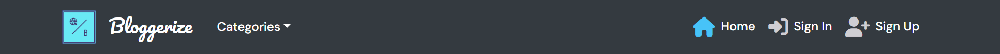

When a user has been authenticated and has logged into their account however, they are shown different links altogether. It doesn't make sense for them to be shown the signin and signup links if they are logged in which is why these links are hidden. The navbar displayed to logged in users can be seen below:

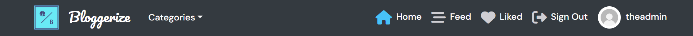

As you can see, a whole new set of links are displayed to a logged in user. These links reflect the added functionality that logged in users have access to which I will go into more detail later. These range from seeing posts liked by a user, posts from a profile followed by the user, a link taking them to their own profile page with their username displayed along with their avatar and a signout link.

Additionally, in order for my navbar to be displayed in a clear way on mobile devices, a hamburger style menu is utilised taken from [React Bootstrap](). This ensures that a user can clearly see and use all available links on the navbar regardless of whatever device they are viewing it on. This added responsive functionality can be seen below:

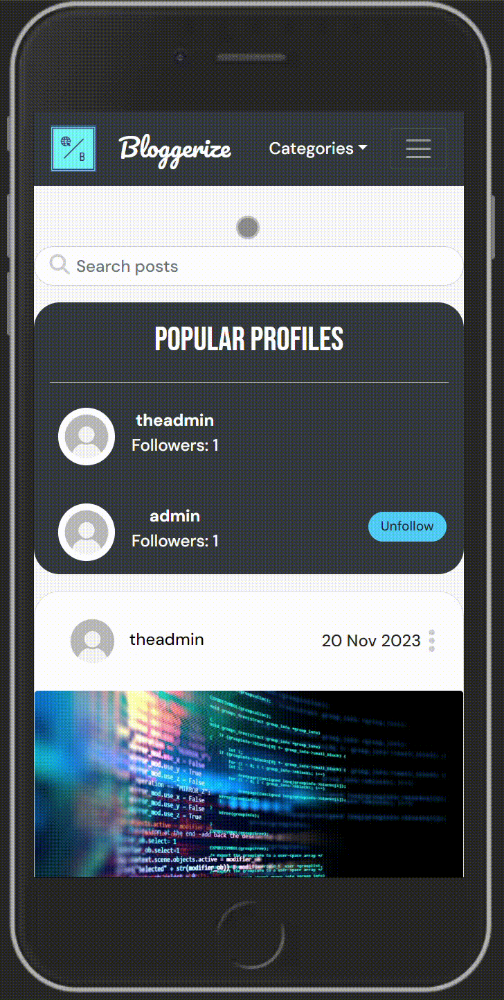

### Homepage

The homepage of my application shows the user every post made by every user. This is sorted with the latest posts being displayed at the top, and the oldest posts displayed at the bottom. This was implemented in order to make it easier for users to view the newest and latest posts as soon as they navigate to the homepage, rather than having to scroll endlessly to view those same posts. This is done primarily by creating a Meta class in my post models.py file seen below:

```
class Meta:
        ordering = ['-created_at']
```

This displays the latest post at the top with the oldest posts at the bottom.

My homepage also has an `InfiniteScroll` component in order to dynamically keep loading posts as the user scrolls down. This gets rid of the need to have multiple pages that the user must navigate to in order to view more posts if there happens to be a lot of them. This is something that most of the popular social media sites implement such as X and Youtube. Whenever a user finds themselves endlessly scrolling through a social media site quickly going through post after post, it is due to this component. The image below shows the homepage of my site.

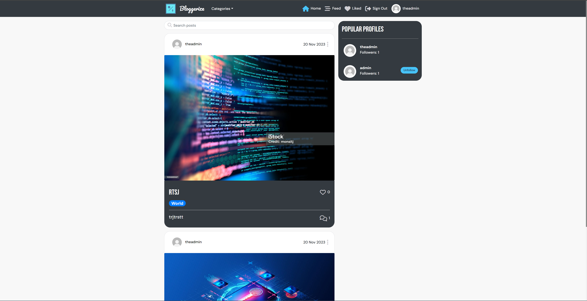

### Popular Profiles

On my homepage, I have decided to include a 'Popular Profiles' tab on the right hand side of the page. As the name suggests, this displays authenticated profiles along with the number of followers they currently have below their username and next to their avatar. Once the user clicks on the link of a profile, they are redirected to that specific profile page. This was done to give the user a quick snapshot of which profiles have the most followers in order to pique their interest and check that profile out along with their posts. In turn, they temselves may decide to follow that particular individual, thus increasing the level of engagement in my site. This can be seen in the image below:

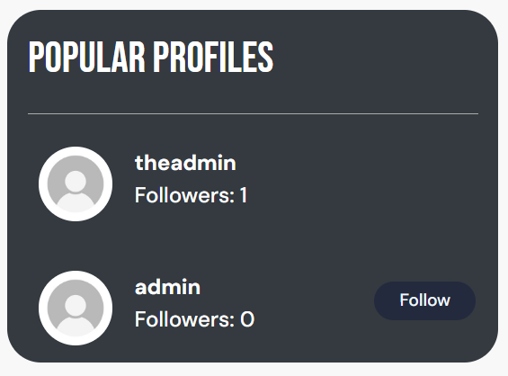

As you can see in the image above, there is the added functionality of following a profile should the user wish to do so. Once they click on the Follow button, the number of followers displayed below their username updates and imcrements once, showing that the user is successfully following that profile and all of their posts will be displayed on their Feed page.

### Post Create page

Only an authenticated user can access the post create page in order to make a blog post. This is done by clicking on the square logo on the top left hand side of the page. If an unauthenticated user clicks on the logo, they are simply redirected to the homepage of my site. The image below shows what this page looks like:

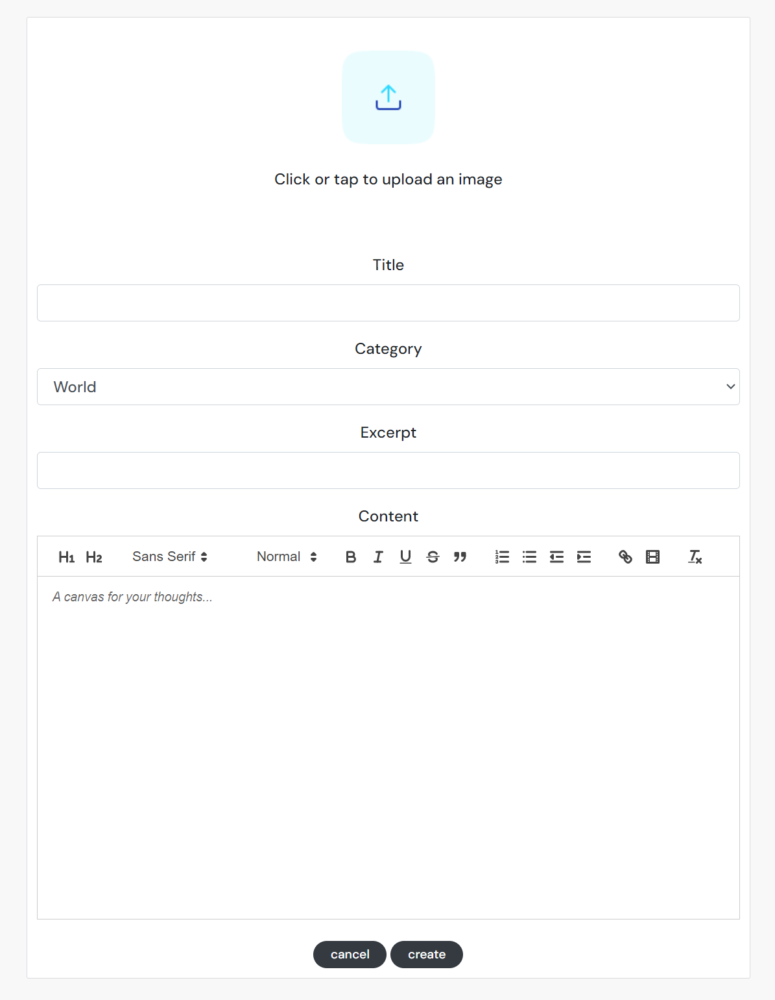

As this is a blogpost create form page, it was important to include fields/options that were relevant to that specific subject matter. For example, I included a category field which is essentially a dropdown menu of premade category types defined in my categories data model in the backend. I also included an excerpt field which will be shown on every post 'card' below the title. 

On the top of the form is an image field where users can upload an image for it to be displayed on the post 'card'. Then there is the self-explanatory title field. The content field is where it gets interesting. As this is a blogpost, I knew that I needed to give users options when it came to the actual content of the post, such as different font styles, creating bullet point lists, being able to easily position different sections of text, adding headers etc. It had to be a text editor of sorts that was implemented only within the content field of my form.

This is why I decided to install React Quill text editor. React Quill is a quick and easy to use editor that allows users to do just that. They have an additional set of options available to them when filling out the content field of their blogs in order to truly customize their blogs and make them unique and individual to them. 

Furthermore, there is the added option of adding hyperlinks to text as well as an embedded video player option which allows users to paste a copied link from a youtube video for example, which then plays within the content field after clicking the video. This can be seen in the gif below:

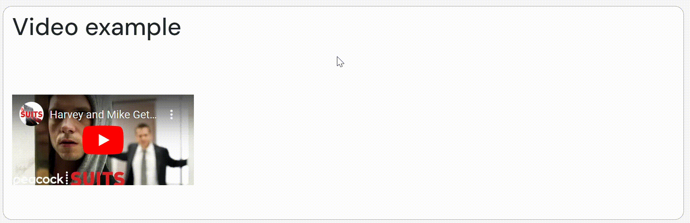

The reason why I decided to add this feature is to present the user with a variety of options available to them should they wish to make use of them. If they want to add a video that they are keen and interested to post a blog about, they can do so easily with this added feature. I also believe that this added functionality makes my particular project stand out from many other blog sites that only lets a user post text and/or images. 

### Categories

I have decided to implement a categories dropdown menu which can be seen next to my logo. This can be accessed by anyone whether they are logged in or not, as it merely sorts and filters each post into a specific category. Once the users clicks on this link, they are shown a dropdown menu of every category that a post will fall under. If the user then clicks on a specific category, every post that falls under that specific category will then be displayed to the user. If there are no posts that are under that category, a suitable message will then be displayed to the user. This can be seen in practice below:


The reason why I included this functionality is to allow users to be able to view the posts that they are specifically interested in. If they have an interest in technology, for example, they merely have to navigate o that specific category page to view all the technology-related blog posts created by users. It allows the user to filter out any posts they are not interested in and only view those they are in a quick and efficient manner.

### Feed page

This page can only be accessed by logged in users as it displays all the posts from a followed profile. As only auythenticated users can follow another profile, that is why logged out users cannot access this page. Once a user decides to follow another profile, each and every post made by that profile owner will be displayed here on the Feed page. If the user is currently not following a user, or the profile they have chosen to follow has not made a post yet, an appropriate message will be displayed to the user. This feature can be seen below:


### Liked page

I have also taken the concept of a liked page from the Moments tutorial in order for users to be able to view each post that they liked. This is also a page that can only be accessed by logged in users, as only they can like posts. This feature can be seen below:


As you can see, this is very similar to the Feed page but instead of showing posts from followed users, it only shows posts the user liked by clicking the heart icon on the post card. Once clicked, the icon turns red to indicate the post has been successfully liked and can be displayed on the Liked page. If the user clicks the icon again, as shown in the gif, it then unlikes the post and will no longer be shown on the liked page after being reloaded and will instead show an appropriate message to the user.

### Sign out

As the name suggests, clicking this link simply logs a user out of their account, which can be seen below.


### Profile link

The very last link that a logged in user is able to see is their profile link which displays the username of the logged in user as well as their saved avatar next to it on the left. Once clicked on, this redirects the user to their own profile page where they can see the number of posts they have made, the number of followers they have, the number of profiles they are currently following as well as their bio which is a short introduction about themselves. Below this, every post that the logged in user has made on the site is displayed on the profile page. This can be seen in the image below:

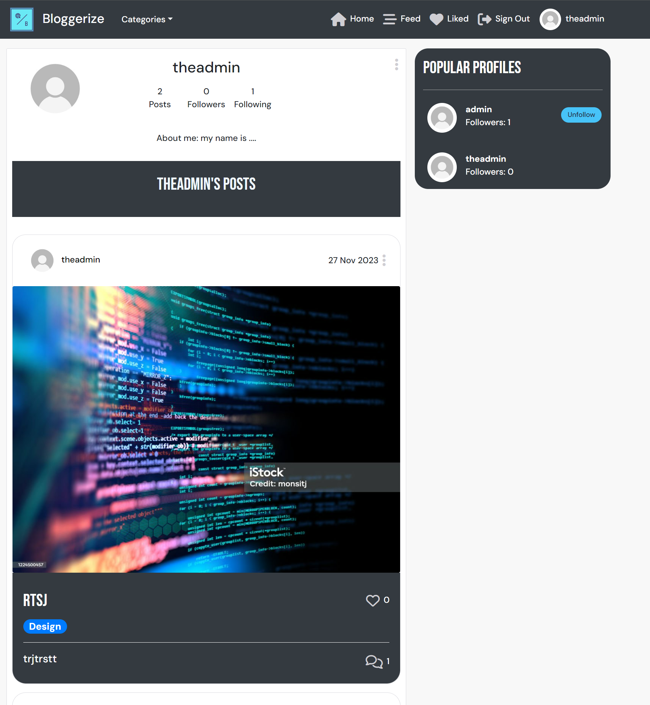

### Search bar

I have also implemented a search bar on the home, feed, liked and categories page in order to filter through individual posts based on what the user types into the search bar. The user can search by the name of a particular profile owner, the title of a particular post, as well as by category. All of these methods can be seen below in the gif:


### Postpage

The post page (not to be confused by the postSpage which is essentially the homepage) is my post detail page which is what the user will see after clicking on either the image of a post 'card', or the comment count icon displayed on the right hand side of the excerpt. This is essentially where the post is displayed alongside the content of the blogpost created by a user. It also displays the comments section at the bottom, where authenticated users can create, read, update and delete their own comments should they wish to. This page can be seen below:


### Signin page 

The signin form requires an authenticated username and password to be entered before a successful login. This page can be seen below:

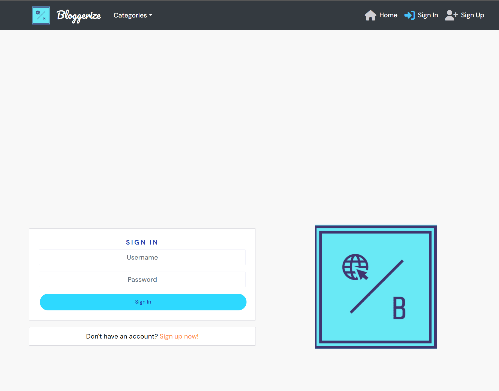

There is also an additional link that redirects users to the sign up page if the user does not happen to have a created account already, as can be seen in the image above.


